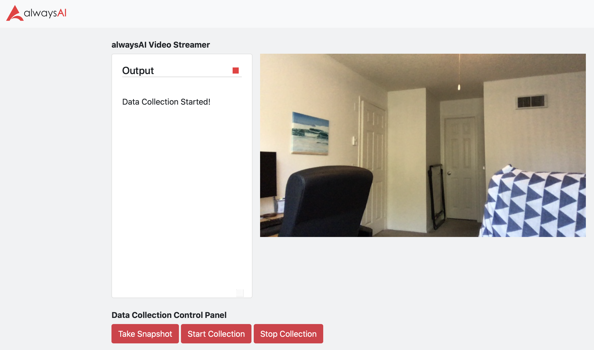
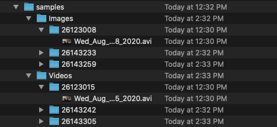

# Data Collection Video Streamer
This alwaysAI app builds off of the app found [here](https://github.com/alwaysai/video-streamer) to provide a cusomized data collection server that allows the user to take snap shots or record videos and store them for later use.



## Requirements
- [alwaysAI account](https://alwaysai.co/auth?register=true)
- [alwaysAI CLI tools](https://dashboard.alwaysai.co/docs/getting_started/development_computer_setup.html)

Create a project on the dashboard from scratch and clone this repo into a local directory. You can find details on working with projects [here](https://alwaysai.co/docs/getting_started/working_with_projects.html).

## Configuration

The app has the following options:

```
$ aai app start -- --help
usage: app.py [-h] [--camera CAMERA] [--use-streamer]
              [--server-addr SERVER_ADDR] [--stream-fps STREAM_FPS]

alwaysAI Video Streamer

optional arguments:
  -h, --help            show this help message and exit
  --camera CAMERA       The camera index to stream from.
  --use-streamer        Use the embedded streamer instead of connecting to the
                        server.
  --server-addr SERVER_ADDR
                        The IP address or hostname of the SocketIO server
                        (Default: localhost).
  --stream-fps STREAM_FPS
                        The rate to send frames to the server in frames per
                        second (Default: 20.0).
```

## Running
For general information on running apps, please see https://alwaysai.co/blog/building-and-deploying-apps-on-alwaysai 

You will need to start up both the Flask server and the data collection app.

### Server
The server is a Flask-SocketIO server that hosts a webpage and a socketio server.

First, create the Python virtual environment with the dependencies. For example, on Linux and Mac run these steps:

```
$ virtualenv venv
$ source venv/bin/activate
(venv) $ pip install -r requirements.txt
```

Now, you should be able to run the app:

```
(venv) $ python app.py
[INFO] Starting server at http://localhost:5001
```

Open the link in a browser on your machine. Next, start the realtime data collection app.


### Data Collection App
Once the alwaysAI toolset is installed on your development machine (or edge device if developing directly on it) you can run the following CLI commands:

Finish setting up your project by running the `aai app configure` command given to you on your project dashboard. Follow the command line prompt to set up the app on your local machine or an edge device.

To start the app using the defaults:

`$ aai app start`

To capture video from camera index 1:

`$ aai app start -- --camera 1`

To connect to the server at 192.168.3.2:

`$ aai app start -- --server-addr 192.168.3.2`

To stream frames at 5 FPS:

`$ aai app start -- --stream-fps 5`

> Note that tha extra `--` in the above commands is used to indicate that the parameters that follow are to be passed through to the python app, rather than used by the CLI.

Once the application has started, you can interact with the data collection app by pressing the three buttons on the 'data collection panel' on the browser.
- Press `Take Snapshot` to take a single image
- Press `Start Collection` to start recording a video
- Press `Stop Collection` to stop recording a video

You can take as many snapshots and videos as you'd like

When you're done with data collection, you can press the red square in the upper righthand square of the text panel of the browser display to close the data collection app. Then return to the console window where you started the flask server and press control-C to bring down flask.

#### Example Output

```
$ aai app start -- --server-addr 192.168.3.2 --stream-fps 5

[INFO] Connecting to server http://localhost:5001...
[INFO] Successfully connected to server.
snapshot signal received
Taking Snapshot
Snapshot Saved
start signal received
Data Collection Started!
stop signal received
Data Collection Ended
snapshot signal received
Taking Snapshot
Snapshot Saved
start signal received
Data Collection Started!
stop signal received
Data Collection Ended
elapsed time: 109.30
approx. FPS: 27.96
Program Ending
```
You will see files generated within `cv/samples/` for each snapshot or video collection you take, as in the image below
